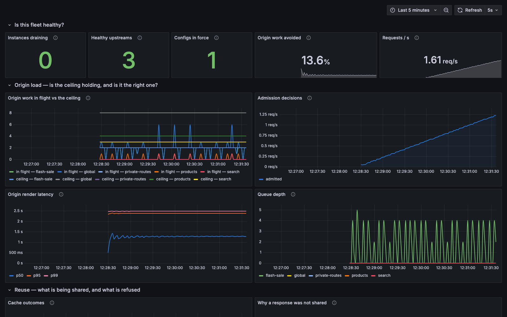

# Harmost

**Stop traffic spikes from becoming render spikes.**

Rust reverse proxy and origin workload governor for Next.js and other SSR
origins: bounded render concurrency, request coalescing, safe microcaching,
bounded queues and load shedding. Built on Pingora.

> [!WARNING]
> **Harmost is under active development and is not ready for production.** It
> is in an early validation, verification, and testing phase. APIs,
> configuration, behavior, and operational guarantees may change without
> notice. Use it only in development or controlled test environments.

**Every conventional defense counts requests. Server rendering made requests
stop being a unit of work.** One route is a cached shell; the next fans out
into a React render, a database round trip, a CMS call and a pricing service.
Rate limiting, connection limits and autoscaling triggers all count requests,
so none of them can tell those two apart.

Harmost counts the work instead. It is an open-source Rust reverse proxy that
bounds how much *rendering* may reach an origin at once, rather than how many
requests arrive. The ordering is the point: cache hits and duplicate requests
are reused **first**, and only genuine cache misses enter per-route and global
admission control, so reuse never spends origin capacity. Whatever the origin
still cannot absorb meets a bounded queue, a deadline, and a defined answer —
stale content or a shed request — instead of an unbounded pile of concurrent
renders.

Harmost is built on [Pingora](https://github.com/cloudflare/pingora), the Rust
proxy framework Cloudflare wrote to replace its NGINX fleet. Cloudflare reports
that Pingora has served more than 40 million Internet requests per second for
years. The parts of a reverse proxy that are
unglamorous and easy to get subtly wrong — connection pooling, HTTP/1 and
HTTP/2 handling, graceful restarts, timeouts, the cache lock — are inherited
from that codebase, and Harmost now exercises that surface end to end: HTTP/1.1
and HTTP/2 in both directions, TLS in both directions, `Upgrade` tunnelling,
`Range` and conditional requests. What Harmost adds on top is the governor:
classification, cache-key and shareability rules, and bounded origin admission.

> A *harmost* (ἁρμοστής, from ἁρμόζω, "to fit, to keep in proper adjustment") was
> an official posted to hold a system in correct adjustment.

## Project maturity and expectations

**Harmost has not been run in production, by anyone, ever.** It has no
production users and no third-party security review. There is now a
[threat model](./docs/THREAT-MODEL.md) and a
[twenty-second adversarial suite](./bench/adversarial.sh) in CI, which is a
smoke test rather than a campaign — and the threat model is the author's own
analysis, which is exactly the thing a threat model is least able to check about
itself.

There is also now a [soak](./bench/soak.sh), a
[memory-pressure test](./bench/memory.sh), a [restart test](./bench/upgrade.sh)
and a [chaos test](./bench/chaos.sh), all of which assert rather than report.
They are synthetic load against a local fixture origin. They can find a leak, a
permit that is never returned, a budget that is not a budget and a restart that
drops requests — and they have found several. They cannot tell you how this
behaves against real traffic on a real network, and no amount of them will.

Reference documentation:

| | |
|---|---|
| [`docs/OPERATIONS.md`](./docs/OPERATIONS.md) | Running it: readiness, drain, restart, systemd, Kubernetes, what to alert on |
| [`docs/CONFIG-SCHEMA.md`](./docs/CONFIG-SCHEMA.md) | Schema versioning, what may change without a bump, migration notes |
| [`docs/BUILDING.md`](./docs/BUILDING.md) | Building, verifying a release, reproducible builds — and what is *not* reproducible |
| [`docs/RELEASE-GATES.md`](./docs/RELEASE-GATES.md) | What has to pass before a tag, and what is deliberately not gated |
| [`docs/THREAT-MODEL.md`](./docs/THREAT-MODEL.md) | What is protected, from whom, and what is not defended |
| [`docs/CACHE-KEY-REVIEW.md`](./docs/CACHE-KEY-REVIEW.md) | A brief for the independent review that has not yet happened |
| [`ops/`](./ops) | Example Prometheus alerts and a Grafana dashboard |
| [`CHANGELOG.md`](./CHANGELOG.md) | What changed in each release, and what to do when upgrading |

Everything described below as a benefit is a **design goal supported by local
tests**, not an outcome observed under real traffic. The focused benchmarks use
a deterministic origin that `sleep`s instead of rendering; a separate Docker
scenario runs one Harmost process against three real Next.js standalone
origins. Together they demonstrate the mechanisms and framework protocol
handling, but they do not predict production traffic, networks or attackers.

Treat it as a working prototype with a serious test suite. If you deploy it, do
so behind something you can fail back to, and read
[Slow readers and render capacity](#slow-readers-and-render-capacity) and
[Roadmap](#roadmap) for the parts that are known to be incomplete.

## Contents

- [Project maturity and expectations](#project-maturity-and-expectations)
- [The problem](#the-problem)
- [Why Harmost exists](#why-harmost-exists)
- [Is Harmost for you?](#is-harmost-for-you)
- [Intended benefits](#intended-benefits)
- [What Harmost does](#what-harmost-does)
- [How Harmost works](#how-harmost-works)
- [Why use Harmost instead of a standard reverse-proxy cache?](#why-use-harmost-instead-of-a-standard-reverse-proxy-cache)
- [Admission control benchmark](#admission-control-benchmark)
- [Request coalescing benchmark](#request-coalescing-benchmark)
- [Streaming coalescing benchmark](#streaming-coalescing-benchmark)
- [Private-response safety check](#private-response-safety-check)
- [Quick start](#quick-start)
- [Installation](#installation)
- [Using Harmost with Next.js](#using-harmost-with-nextjs)
- [Project status](#project-status)
- [Roadmap](#roadmap)
- [Design principles](#design-principles)
- [Operating Harmost](#operating-harmost)
- [Slow readers and render capacity](#slow-readers-and-render-capacity)
- [Request coalescing and microcache architecture](#request-coalescing-and-microcache-architecture)
- [Next.js caching and cache-key design](#nextjs-caching-and-cache-key-design)
- [Configuration](#configuration)
- [Security](#security)
- [License](#license)

## The problem

A server-rendered request is not a cheap request. One hit on a Next.js route can
fan out into React rendering, a database round trip, a CMS call, a pricing
service and a recommendations service. Ten thousand requests can become ten
thousand of each.

React Server Components sharpen this. The same URL returns a full HTML render
or an RSC flight payload depending on a request header, and a prefetch costs
something different again — so the cost of a request is not merely high, it is
invisible from the URL. Anything counting requests is counting a unit that no
longer means anything.

That matters because SSR origins fail non-linearly. A Node process serving a
200 ms render comfortably at 50 concurrent requests does not serve 500 concurrent
requests ten times slower — it starts queueing inside the event loop, latency
climbs faster than load, health checks begin timing out, the orchestrator
restarts pods, and the surviving pods inherit the traffic that killed the last
ones.

Conventional protection is a poor fit for this shape:

- **Request-per-second rate limiting** counts requests, not work. A cheap static
  asset and an expensive product page cost the same against the limit.
- **A reverse-proxy cache** helps only where responses are cacheable. Next.js
  [documents dynamically rendered pages](https://nextjs.org/docs/app/guides/self-hosting#automatic-caching)
  as private and non-cacheable, so a conventional shared cache skips precisely
  the traffic that hurts.
- **Autoscaling** reacts on the order of tens of seconds. A traffic spike arrives
  in one.

## Why Harmost exists

Because the useful unit to bound is *origin work*, not requests, and few
off-the-shelf proxy configurations combine per-route work limits, a bounded
queue, a deadline, reuse-before-admission and a defined overload response.

Request collapsing is old news — Varnish, `proxy_cache_lock`, Fastly and Apache
Traffic Server have done it for years. Harmost's argument is the other half:
duplicate work is reused *first*, and whatever genuinely has to reach the origin
then passes through admission control that can say no.

### Scope: Next.js today, framework-agnostic by design

Harmost's policy contract — routes, work classes, cache keys, shareability
rules — does not assume a framework. Next.js is the first and only supported
adapter because that is where the traffic is, not because the design depends on
it. The Next-specific surface is request classification: the `RSC`,
`Next-Router-Prefetch` and `Next-Action` headers, draft mode, and `/_next/*`
assets. Nothing beneath that layer knows which framework produced the response.

Any origin whose responses are expensive to produce has the same shape, so
other React Server Components frameworks — and non-JavaScript SSR origins — are
plausible targets. **None are supported today.** Additional adapters land only
once the generic contract is stable enough that adding one cannot bend it; see
[Roadmap](#roadmap) phase 4.

## Is Harmost for you?

The question is not whether you have high traffic. It is whether your peak
concurrency can exceed your origin's render capacity, and what happens when it
does. Small origins have very little capacity, so the answer is often yes at
traffic volumes that sound unremarkable.

Concurrency is arrival rate multiplied by render time. A Node process handles
roughly 50 concurrent renders before its event loop begins queueing, so two
pods give you on the order of 100. With a 500 ms render you reach that at about
200 requests per second — and the requests that get you there are frequently
not the ones you planned for:

- **A visitor is not a request.** The App Router prefetches on hover and on
  viewport entry, so one person browsing produces several origin requests.
  What each costs depends on the route, but none of them appear in a page-view
  count.
- **Crawlers and scrapers do not care how popular you are.** An automated
  client walking thousands of distinct URLs produces sustained concurrency
  against your origin regardless of your organic traffic. Every URL is unique,
  so every one is a cache miss and none of them can be collapsed. This is the
  case where caching and coalescing offer nothing at all and bounded admission
  is the only mechanism that applies.
- **Small sites have spikier traffic than large ones.** A large site's load is
  comparatively smooth. A small site's load is a launch, a drop, a newsletter
  or a link from somewhere busy — a step change, not a curve.

There is a second reason unrelated to outages. Without admission control, the
only way to survive a peak is to provision for it: run enough pods for the
worst thirty seconds and pay for them the rest of the day. Bounding origin work
is what makes running fewer pods a considered decision rather than a gamble.

### Harmost is likely to help if

- You self-host a server-rendered application on infrastructure you own or
  operate, and a slow or failing origin is your problem to fix.
- A meaningful share of your traffic is dynamic, personalized or otherwise
  uncacheable, so a conventional cache skips it.
- Your traffic is bursty, automated, or both, and your headroom is a small
  multiple of your steady-state load rather than a large one.
- An origin overload costs you something — revenue, a launch, an on-call night.

### Harmost is unlikely to help if

- **Your site is static or fully pre-rendered.** There is no render cost to
  govern; a CDN is the entire answer.
- **You run on Vercel, Netlify or Cloudflare.** You do not own the origin, the
  platform already collapses duplicate requests and scales the render tier for
  you, and Harmost has nowhere useful to sit.
- **Your origin is already mostly cacheable.** If ISR or a plain CDN absorbs
  your traffic, a governor is protecting capacity that was never under threat.
- **A spike-induced outage costs you nothing.** A personal site does not need
  an additional hop, an additional configuration and an additional failure
  mode.

The cost side deserves the same scrutiny. Harmost is another process in your
request path, another configuration to maintain and another failure mode to
understand, and today it is
[unproven software](#project-maturity-and-expectations). For a small
deployment, adding a pod or putting a CDN in front is sometimes simply the
better trade.

If you want to know where you stand before installing anything, the useful
measurements are your origin's **peak concurrent in-flight requests** and your
**render latency** — not requests per day. Their product against your pod count
is the number Harmost exists to bound.

## Intended benefits

Stated as goals, for the reasons in
[Project maturity](#project-maturity-and-expectations). Each links to the
benchmark that demonstrates the mechanism locally.

| Goal | Mechanism | Demonstrated by |
| --- | --- | --- |
| One Harmost process never admits more render work than its configured ceilings | Global and per-route concurrency limits with bounded queues | [`bench/demo.sh`](#admission-control-benchmark) |
| A burst on one URL costs one render, not thousands | Request coalescing on the cache lock | [`bench/coalesce.sh`](#request-coalescing-benchmark) |
| Collapsing does not destroy streaming | Waiters attach to the in-flight write | [`bench/stream.sh`](#streaming-coalescing-benchmark) |
| Overload degrades predictably instead of collapsing | Bounded queues, deadlines, stale-or-shed | [`bench/demo.sh`](#admission-control-benchmark) |
| Authorization-bearing requests and `Set-Cookie` responses are never shared | Absolute request/response barriers | [`bench/safety.sh`](#private-response-safety-check) |
| A slow client cannot make Harmost release render capacity early | Permits remain held until observed origin end-of-stream; downstream writes have a timeout | [`bench/slowclient.sh`](#slow-readers-and-render-capacity) |

What Harmost explicitly does **not** promise: lower latency. Bounding
concurrency makes a burst slower on purpose — see the wall-clock discussion in
[Why use Harmost](#why-use-harmost-instead-of-a-standard-reverse-proxy-cache).

## What Harmost does

- **Protects SSR origins from traffic spikes** with global and per-route
  concurrency limits.
- **Collapses duplicate concurrent renders** so identical requests share one
  in-flight origin response when it is safe to do so.
- **Microcaches public server-rendered pages** with strict response
  shareability checks and route-level TTL ceilings.
- **Bounds overload queues** with explicit queue sizes and deadlines, then
  serves stale content or sheds load instead of overwhelming the origin.
- **Understands Next.js request variants**, including React Server Components,
  prefetch requests, draft mode, Server Actions, and static assets.
- **Keeps private responses private** by treating `Set-Cookie`, authorization,
  unsafe `Vary` headers, unsafe methods and unsafe statuses as absolute
  barriers. Origin `private`, `no-store` and `no-cache` directives are honoured
  unless a route is explicitly fenced as public and configured to override
  them. Cookie-bearing requests are private by default and likewise require an
  explicit route assertion before reuse is considered.
- **Balances requests across origins** with round-robin or path-stable hashing.

Typical use cases include protecting Next.js storefronts during product drops,
absorbing bursts on public SSR pages, and enforcing predictable origin capacity
for mixed public, private, static, and dynamic routes.

> [!NOTE]
> **Harmost is not a replacement for NGINX, Apache, Caddy or a general-purpose
> web server.** It is a specialised reverse proxy for governing SSR origin
> work. It does not currently provide the broad feature set expected from a
> general edge server, such as native TLS termination, full virtual-host/site
> configuration, static file serving, redirects and rewrites, WebSocket
> handling, authentication modules or a mature plugin ecosystem. Harmost may
> occupy the reverse-proxy hop in a narrow deployment, but it is not a drop-in
> substitute. A load balancer, ingress, CDN or conventional web server can
> remain in front of it for those responsibilities.

For production today, plan to run an edge component in front of Harmost:

```text
Client -> NGINX / CDN / load balancer / ingress -> Harmost -> Next.js
```

If you already use NGINX, keep it for TLS termination and general edge duties;
Harmost adds SSR caching, request coalescing and bounded origin admission behind
it. NGINX is not mandatory specifically—a CDN, cloud load balancer or Kubernetes
ingress can fill that role. For local development or a trusted private network
using cleartext HTTP, clients can connect directly to Harmost.

## How Harmost works



Harmost resolves the route and request class before checking for a safe cached
or in-flight response. Only a genuine cache miss enters the bounded per-route
and global admission queues. Accepted work reaches the SSR origin; excess work
receives an eligible stale response or is shed when the queue is full or its
deadline expires. Every origin response is checked again before it can be
shared or stored.

## Why use Harmost instead of a standard reverse-proxy cache?

Request collapsing is not new — Varnish, `proxy_cache_lock`, Fastly and Apache
Traffic Server have all done it for years, and forty lines of `nginx.conf` will
collapse a thousand concurrent hits on one URL down to a single origin request.

Harmost's intended distinction is the combination: reuse equivalent work
before applying per-route and global render ceilings, then use bounded queues
and stale-or-shed overload handling. Similar pieces exist elsewhere; Harmost
packages them around SSR work as one policy pipeline.

So the demo that matters is not the cacheable one.

## Admission control benchmark

```
$ ./bench/demo.sh 60 1000

60 concurrent requests, 60 unique URLs, 1000ms render
nothing cacheable, nothing coalescible — admission control only

  direct to origin       peak=60     wall=1s
  through harmost        peak=10     wall=6s

  configured ceiling     10
  origin peak, direct    60
  origin peak, harmost   10
```

The origin reports its own peak concurrency, so the result does not depend on
trusting the proxy's own metrics.

Read the wall-clock column honestly: harmost made this workload *slower*. Sixty
renders that a healthy origin could absorb at once were served ten at a time.
That is the trade — bounded latency growth instead of an origin driven past the
point where it recovers. The demo fixture sleeps rather than rendering, and a
sleep parallelises perfectly, so it shows the concurrency bound while
understating what the bound buys you: a real renderer at 6× its healthy
concurrency does not degrade linearly.

Caching and coalescing are the bonus. Governing is the product.

## Request coalescing benchmark

```
$ ./bench/coalesce.sh 100 1000

100 concurrent requests for ONE url, 1000ms render

  requests served        100 / 100
  origin renders         1

  X-Harmost breakdown:
      99 HIT
       1 MISS
```

## Streaming coalescing benchmark

Collapsing is only worth having if waiters still receive bytes as the leader
produces them. Otherwise every waiter but the leader trades a 1 ms first byte
for a full-render one.

```
$ ./bench/stream.sh 20 5 400

20 concurrent requests for one streaming url
(5 chunks, 400ms apart — the origin takes ~1600ms to finish)

  requests served       20
  median TTFB           0.002s
  max TTFB              0.009s
  median total          1.607s
  origin requests       1
```

One render, twenty responses, and every waiter held the shell within 9 ms while
that render was still in progress.

The render count comes from the fixture origin's own counter, read back from
its `/__stats` endpoint. It used to be derived by grepping the *proxy's* access
log for upstream lines — measuring the component under test with an expression
that silently returned `0` whenever the log format changed.

## Private-response safety check

Same route, same permissive config. This path answers with `Set-Cookie`:

```
$ ./bench/safety.sh 50

  requests served        50 / 50
  distinct session ids   50
  origin renders         50

  X-Harmost breakdown:
      50 MISS

PASS: every request got its own session; nothing was shared
```

Fifty renders where a moment ago there was one. That is the design working, not
failing: shareability is a property of the *response*, and no route
configuration can override a response that addresses one person.

## Quick start

Harmost requires Rust 1.88 or newer.

```bash
git clone https://github.com/akosidencio/harmost.git
cd harmost

# Run the test suite.
cargo test --workspace

# Validate the example configuration.
cargo run -- check --config harmost.yaml

# Start the reverse proxy.
cargo run -- run --config harmost.yaml
```

The example listens on `0.0.0.0:8080` and forwards requests to the upstreams
defined in [`harmost.yaml`](./harmost.yaml). Update those upstream addresses
before sending production traffic.

The mechanism claims in this README have local benchmark scripts. Each starts a
test origin and proxy, runs load, and tears both down:

```bash
./bench/all.sh                # every benchmark below, as one gate
./bench/demo.sh 60 1000       # bounded admission: origin peak 10 vs 60 direct
./bench/coalesce.sh 100       # 100 concurrent requests, one origin render
./bench/stream.sh 20 5 400    # collapsing without breaking streaming
./bench/safety.sh 50          # a Set-Cookie response is never shared
./bench/slowclient.sh         # slow-reader backpressure and the permit lifetime bound
./bench/reload.sh             # SIGHUP reload, including a refused one
./bench/nextjs.sh             # one Harmost process, three real Next.js origins
./bench/nextjs-browser.sh     # the same stack, driven by Chromium
```

Every script asserts its own claim and exits non-zero when it fails, so each is
a gate rather than a report. Each also prints the parameters it ran with next
to its numbers; set `BENCH_REPORT_DIR` to collect one JSON file per benchmark
carrying both, which is what CI publishes as an artifact. A result is a
measurement of one machine, not a baseline, and the parameter block is what
makes it comparable to another.

The harness in [`bench/lib.sh`](./bench/lib.sh) tracks the exact pid of every
process it starts and allocates its ports per run, so a benchmark cannot kill
an unrelated Harmost on the same machine or measure whatever else was already
listening on 8080.

The focused scripts measure against [`bench/slow-origin`](./bench/slow-origin),
a fixture that `sleep`s instead of rendering and reports its own render counts
at `/__stats`, so no assertion depends on the proxy's account of its own work.
`nextjs.sh` instead builds the standalone application in
[`fixtures/next-storefront`](./fixtures/next-storefront) — which serves both an
App Router and a Pages Router surface — starts three independently identified
origins, and makes machine-checked assertions across their combined traffic.
`nextjs-browser.sh` drives that same stack with Chromium, because the two
behaviours a curl-written request cannot reach are the ones Next's own client
constructs: a router prefetch carrying a real `Next-Router-State-Tree`, and a
Server Action POST carrying an action id the build assigned. Neither setup
predicts behaviour under real traffic — see
[Project maturity](#project-maturity-and-expectations).

## Installation

Harmost is not on crates.io and there are no standalone release binaries.

Tagged releases publish a `linux/amd64` container image to GitHub Packages at
`ghcr.io/akosidencio/harmost`, built from the repository
[`Dockerfile`](./Dockerfile). The same Dockerfile builds a local image for
testing and as a base for deployment work.

```bash
docker pull ghcr.io/akosidencio/harmost:<version>
```

The published image is built **with** `--features tls`, because nobody can
recompile a container to turn a feature on.

To build from source:

```bash
git clone https://github.com/akosidencio/harmost.git
cd harmost
cargo build --release

# Add native TLS termination and origin TLS. rustls, so this needs no cmake,
# no Go and no system OpenSSL headers — it just costs about two minutes of
# compile time, which is why it is not the default.
cargo build --release --features tls
```

The container image takes the same choice as a build argument:

```bash
docker build --build-arg FEATURES=tls -t harmost:tls .
```

The binary lands at `target/release/harmost`.

```bash
./target/release/harmost version
./target/release/harmost check --config harmost.yaml   # validate, don't start
./target/release/harmost run   --config harmost.yaml   # start the proxy
```

`harmost check` exits non-zero on an invalid or unsafe configuration, so it
works as a CI gate on a config change.

Signals: `SIGHUP` reloads reloadable policy in place; `SIGUSR1` enters drain
without exiting; and `SIGTERM` automatically advertises not-ready for the
configured drain window before Pingora stops its listeners. On Linux,
`--upgrade` plus `SIGQUIT` performs Pingora's socket-handover workflow.

**Listeners are cleartext unless you build with `--features tls` and configure
`server.tls`.** A binary built without the feature *rejects* a config containing
`server.tls` or `origin.tls` rather than starting with a dead port.

The recommended topology is still to terminate TLS at a load balancer or
ingress in front of Harmost and keep the Harmost-to-origin network private —
that edge is also your fail-back path. If you do that, set
[`server.trusted_proxies`](#trusted-proxies): without it every forwarded header
is ignored, so the origin sees your load balancer as the client and
`X-Forwarded-Proto: http` on an HTTPS site. Ignoring them is the safe default
and the wrong configuration.

## Using Harmost with Next.js

> **This is locally validated, not production validated.** The repository runs
> one Harmost process against three real Next.js 16 standalone origins and
> verifies coalescing, origin distribution, HTML/RSC separation, `Set-Cookie`
> isolation, mutation bypass, Draft Mode isolation and Suspense streaming. The
> configuration schema remains pre-1.0, and no managed-platform or production
> deployment has been validated. See
> [Project maturity](#project-maturity-and-expectations).

### Reproduce the real Next.js proof

Docker Desktop or another Docker Engine with Compose is required:

```bash
./bench/nextjs.sh
```

The script builds the repository's Harmost image and one standalone Next.js
image, then starts this private origin pool:

```text
localhost:18080 -> Harmost -> next-1:3000
                            -> next-2:3000
                            -> next-3:3000
```

It proves that 24 simultaneous requests for one public SSR URL produce one
origin render, distinct paths reach all three origins, HTML and canonical RSC
payloads stay in separate cache entries, 16 private requests receive 16 unique
sessions, `Next-Action` mutations bypass reuse, Draft Mode cannot contaminate a
cached public preview, and coalesced clients receive a real Suspense shell
before the slow region completes. All assertions use Harmost's combined origin
counters and response contents; the stack is removed on exit.

### What you install, and where

Harmost is a **standalone binary that runs as its own process**, in front of
your Next.js server. It is not an npm package, not a dependency, not Next.js
middleware, and not something you import. **Your application code does not
change at all** — the only optional edit is adding a health endpoint, below.

What changes is the network path. Today:

```
client ──▶ next start (:3000)
```

With Harmost:

```
client ──▶ harmost (:8080) ──▶ next start (:3000)
```

Next.js stops being publicly reachable and listens only for Harmost. Whatever
used to point at Next — your load balancer, your CDN origin, your DNS record —
now points at Harmost instead.

#### One server

Both processes on the same box. Harmost takes the public port, Next binds to
loopback so nothing can reach it directly.

```yaml
server:
  listen: "0.0.0.0:8080"
origin:
  upstreams: ["127.0.0.1:3000"]
```

```bash
# terminal 1 — or a systemd unit / pm2 process
next start -p 3000 -H 127.0.0.1

# terminal 2
harmost run --config /etc/harmost/harmost.yaml
```

#### Docker Compose

Harmost is the only service publishing a port; `web` is reachable only on the
internal network. Released images live at `ghcr.io/akosidencio/harmost`; the
shipped [`Dockerfile`](./Dockerfile) builds the same image locally if you would
rather tag it yourself.

```yaml
services:
  harmost:
    image: ghcr.io/akosidencio/harmost:0.1.0   # or a locally built harmost:local
    ports: ["8080:8080"]
    volumes:
      - ./harmost.yaml:/etc/harmost/harmost.yaml:ro
    command: ["run", "--config", "/etc/harmost/harmost.yaml"]
    depends_on: [web]

  web:
    image: my-next-app
    expose: ["3000"]        # not `ports` — no host publishing
```

with `upstreams: ["web:3000"]`.

The complete local example is [`compose.nextjs.yaml`](./compose.nextjs.yaml).

#### DigitalOcean App Platform

Kubernetes is not required. Put Harmost and Next.js in the same App Platform
app as two container services:

```text
App Platform public ingress -> harmost:8080 -> nextjs:3000 (internal only)
```

Pull Harmost from `ghcr.io/akosidencio/harmost` (or build this repository's
[`Dockerfile`](./Dockerfile) yourself) and push your own application image —
the fixture's [standalone Dockerfile](./fixtures/next-storefront/Dockerfile) is
a worked example — to DOCR, GHCR or Docker Hub. Give only Harmost a public
HTTP port and route; give Next.js only internal port `3000`, make both bind
`0.0.0.0`, and set Harmost's upstream to `nextjs:3000`. Bake or securely generate `harmost.yaml` in the
Harmost image because App Platform does not provide Kubernetes ConfigMaps.

Start with one fixed Harmost instance so cache, coalescing and admission state
have one owner. This topology is the intended first managed-platform staging
test after the local release gates pass; it has not been run on DigitalOcean
yet.

#### Kubernetes

Harmost is its own Deployment and Service, between the Ingress and the Next
Service. The Next Service becomes `ClusterIP` and is no longer an Ingress
backend.

```
Ingress ──▶ Service/harmost ──▶ Deployment/harmost (2 replicas)
                                        │
                                        ▼
                               Service/web ──▶ Deployment/web (N pods)
```

with `upstreams: ["web.default.svc.cluster.local:3000"]`.

Keep the Harmost replica count low. Coalescing only collapses requests that
reach the *same* instance, so replicas divide the benefit — and an autoscaler
that adds replicas during a spike reduces collapsing exactly when it is most
wanted. Concurrency limits are also per process: two replicas configured with a
ceiling of 100 can admit up to 200 origin requests between them. Size the
per-process limit accordingly. If you need more than a few replicas, have the
Ingress consistent-hash on path so one key lands on one instance.

#### Where this does not work

**A normal Vercel, Netlify, or similar managed deployment.** Those platforms do
not provide a place to run Harmost immediately beside the application origin.
Harmost currently targets infrastructure where you control both hops — a VPS,
ECS, Fly, Kubernetes or bare metal — with optional CDN/TLS termination in
front.

### A worked configuration

```yaml
version: 1

server:
  listen: "0.0.0.0:8080"

origin:
  upstreams:
    - "next-1:3000"
    - "next-2:3000"
  # Sends a given path to the same instance, which also warms Next's own
  # in-process render cache and JIT state.
  load_balancing: hash_by_path
  concurrency:
    max: 200                 # per Harmost process, across this upstream pool
    queue:
      max: 1000
      timeout: 2s

cache:
  enabled: true
  max_memory: 512MiB
  max_body_size: 4MiB

routes:
  # Fingerprinted assets. Immutable, freely shareable, and exempt from the
  # render budget — serving a JS chunk is not rendering.
  - id: next-static
    match: "/_next/static/**"
    class: static

  # The image optimiser is expensive and its output is keyed by query.
  - id: next-image
    match: "/_next/image"
    class: public_dynamic
    cache:
      ttl:
        max: 60s
      query:
        mode: include
        keys: ["url", "w", "q"]
    concurrency:
      max: 20

  # Public product pages. A dynamically rendered Next route answers
  # `Cache-Control: private, no-store`, so `override_origin` is required or
  # nothing here is ever cached or collapsed.
  - id: products
    match: "/products/**"
    class: public_ssr
    cache:
      override_origin: true
      ttl:
        max: 2s
      stale_while_revalidate: 30s
      stale_if_error: 5m
    coalesce:
      enabled: true
    concurrency:
      max: 100
      queue:
        max: 300
        timeout: 1500ms

  # Per-user routes. Never cached, never collapsed — but still bounded, which
  # is most of the protection.
  - id: account
    match: "/account/**"
    class: private_dynamic
    cache:
      enabled: false
    concurrency:
      max: 40
      queue:
        max: 100
        timeout: 1s

  # Anything not named above is treated as private. Make the unsafe case the
  # one you have to opt into, not the one you get by forgetting.
  - id: default
    match: "/**"
    class: private_dynamic
    cache:
      enabled: false

telemetry:
  prometheus:
    listen: "127.0.0.1:9090"
  logging:
    format: json
```

### What the Next.js adapter handles for you

The adapter applies these classifications automatically. Route and response
policy still decide whether reuse is ultimately allowed:

- **React Server Components.** The same URL returns HTML or an RSC flight
  payload depending on the `RSC` header, so `RSC`, `Next-Router-Prefetch`,
  `Next-Router-State-Tree`, `Next-Router-Segment-Prefetch` and `Next-Url` are
  part of every non-static document key, including when absent. Without that,
  a flight payload can eventually be served to a browser as a document; Next
  also names these selectors in `Vary` on ordinary HTML responses.
- **Prefetch requests** are marked coalesce-only and never stored. They are
  collapsed only when the route and response policy permit sharing; the router
  state tree makes persistent storage too high-cardinality.
- **Server Actions** (`POST` carrying `Next-Action`) are classified as
  mutations and bypass cache reuse and coalescing. They remain admission
  controlled.
- **Draft mode.** A request carrying `__prerender_bypass` or
  `__next_preview_data` bypasses reuse and is treated as private, so unpublished
  content is never stored or shared. It remains admission controlled.

### Two things that will bite you

**Next.js has no guaranteed built-in health endpoint.** The repository's
[`harmost.yaml`](./harmost.yaml) probes `/healthz`, which a stock application
does not automatically provide — every backend would fail its probe. Add one:

```ts
// app/healthz/route.ts
export const dynamic = "force-dynamic";
export function GET() {
  return new Response("ok");
}
```

Or omit the `health:` block entirely. Harmost still serves when nothing is
healthy, on the grounds that refusing to pick turns a degraded origin into a
guaranteed outage — so a misconfigured probe degrades quietly rather than
loudly, which is exactly how it goes unnoticed.

**`Upgrade`/WebSocket traffic is refused unless you enable it.** Hot module
reload in `next dev`, and any WebSocket route in production, needs:

```yaml
upgrade:
  enabled: true
  max_concurrent: 100
```

A handshake arriving while this is off is answered `501 Not Implemented` — not
the overload status, because nothing is overloaded and a retry will never
succeed. When it is on, upgraded connections take their own ceiling and never a
render permit: a socket is held for minutes and a render for milliseconds, so
letting them share a budget means a handful of sockets can starve every page.
They are also never cached and never coalesced, whatever the route says.
See [`bench/websocket.sh`](./bench/websocket.sh).

### Verifying it is doing anything

```bash
curl -sI localhost:8080/products/example | grep -i x-harmost   # needs debug_headers: true
curl -s localhost:9090/metrics | grep -E 'reuse_eligible|origin_requests'
```

The second pair is the ratio worth watching: `harmost_origin_requests_total`
over `harmost_reuse_eligible_requests_total` is the share of eligible traffic
that still reached the origin.

## Project status

**Not production ready.** Harmost is under active development and remains in an
early validation, verification, and testing phase. It runs as a Pingora reverse
proxy with experimental cache and request-coalescing integration, but it has
not completed production hardening or operational validation.

| Area | State |
| --- | --- |
| Config schema, units, validation | done, tested |
| Route matching and policy snapshot | done, tested |
| Request classification (generic + Next.js) | done, tested |
| Cache key construction | done, tested |
| Response shareability rules | done, tested |
| Admission control, queueing, load shedding | done, tested |
| Cache store | implemented with Pingora `Storage` ([spike](./spike/pingora-cache/FINDINGS.md)) |
| Request coalescing | implemented with `pingora-cache` cache locks |
| Pingora proxy layer | proxy, routing, admission, upstream selection wired |
| Cache and coalescing wiring | implemented; experimental |
| Prometheus metrics, JSON/text access logs | done |
| Active health checks | done |
| Graceful reload (SIGHUP) | done |
| Stale-while-revalidate, stale-if-error | done |
| Real Next.js fixture (App Router + Pages Router) | done; local Docker integration tested |
| Browser-driven prefetch and Server Action checks | done (Chromium, [`bench/nextjs-browser.sh`](./bench/nextjs-browser.sh)) |
| Property tests and fuzz targets | done ([`fuzz/`](./fuzz)); 7 targets run in CI |
| HTTP/2 downstream (h2c and ALPN) and upstream | done, tested ([`bench/http2.sh`](./bench/http2.sh)) |
| `HEAD`, `Range`, conditional requests, disconnects, malformed bodies | done, tested ([`bench/protocol.sh`](./bench/protocol.sh)) |
| `Upgrade`/WebSocket proxying, bounded separately from renders | done, tested, off by default ([`bench/websocket.sh`](./bench/websocket.sh)) |
| Native TLS, downstream and upstream (`--features tls`) | done, tested ([`bench/tls.sh`](./bench/tls.sh)); [Pingora labels its rustls backend experimental](https://github.com/cloudflare/pingora#feature-highlights), so external TLS termination remains recommended |
| Trusted proxies, forwarded scheme and client IP | done, tested ([`bench/forwarded.sh`](./bench/forwarded.sh)) |
| Bounded response spool | done, tested ([`bench/spool.sh`](./bench/spool.sh)) |
| Threat model | [written](./docs/THREAT-MODEL.md); **not independently reviewed** |
| Independent review of cache keys and shareability | **not obtained**; brief prepared at [`docs/CACHE-KEY-REVIEW.md`](./docs/CACHE-KEY-REVIEW.md) |
| Sustained adversarial testing | 20s in CI ([`bench/adversarial.sh`](./bench/adversarial.sh)); a smoke test, not a campaign |
| Readiness, liveness and status endpoints | done, tested ([`bench/admin.sh`](./bench/admin.sh)) |
| Drain state, `SIGUSR1`, graceful restart | done, tested ([`bench/upgrade.sh`](./bench/upgrade.sh)) |
| Pingora zero-downtime socket handover | done, tested — **Linux only**; `--upgrade` is refused elsewhere ([`bench/upgrade.sh`](./bench/upgrade.sh)) |
| W3C trace-context correlation | done, tested; unconditional ([`bench/tracing.sh`](./bench/tracing.sh)) |
| OpenTelemetry span export | done, tested — OTLP/HTTP JSON, **plaintext only** ([`bench/tracing.sh`](./bench/tracing.sh)) |
| Config schema version and migration notes | done ([`docs/CONFIG-SCHEMA.md`](./docs/CONFIG-SCHEMA.md)) |
| Soak, memory-pressure, restart and chaos tests | done ([`soak.sh`](./bench/soak.sh), [`memory.sh`](./bench/memory.sh), [`upgrade.sh`](./bench/upgrade.sh), [`chaos.sh`](./bench/chaos.sh)); CI-sized on every push, full size before a tag ([gates](./docs/RELEASE-GATES.md)) |
| Example Prometheus alerts and Grafana dashboard | done ([`ops/`](./ops)) |
| Release binaries, checksums, SBOM, reproducible builds | workflow written ([`docs/BUILDING.md`](./docs/BUILDING.md)); **no release has been cut yet**, so the reproducibility claim is untested by anyone but its author |
| Circuit breaking, least-loaded balancing | not started ([roadmap](#roadmap)) |
| Cache purge API | not started ([roadmap](#roadmap)) |

The security- and correctness-sensitive parts — cache-key construction, response
shareability, and bounded admission — remain isolated as testable logic beneath
the Pingora proxy layer. The full workspace test suite (276 tests, including
property tests over generated inputs) runs without external network services.

"done, tested" means unit-tested and, where a `bench/` script exists, verified
end to end against a local test origin. It does not mean production-validated;
see [Project maturity](#project-maturity-and-expectations).

Configuration options that are accepted but not yet implemented are rejected at
startup rather than silently ignored, so a config can never claim a protection
that is not running.

## Roadmap

Ordered by dependency and risk rather than novelty. Later phases depend on the
evidence and safety work before them.

### 0. Make the evidence trustworthy — done

- **Benchmark harness.** [`bench/lib.sh`](./bench/lib.sh) tracks the exact pid
  of every process it starts and allocates ports per run, replacing
  `pkill -f target/debug/harmost` (which killed every Harmost on the machine)
  and the hardcoded 3000/8080/9090. Readiness is polled rather than slept
  through. Every script asserts and exits non-zero on failure — `reload.sh`
  previously printed log lines and checked nothing, and now proves the new
  ceiling took effect by measuring the origin's peak concurrency after the
  reload rather than trusting the "config reloaded" message. `stream.sh`
  counted renders by grepping the proxy's own access log, an expression that
  returned `0` whenever the log format changed; both it and every other script
  now read the fixture origin's own `/__stats` counter.
- **Framework coverage.** The fixture serves a Pages Router surface alongside
  the App Router, and `nextjs.sh` asserts across both: `getServerSideProps`
  coalescing, the `/_next/data/<buildId>/…json` payload keyed apart from its
  own document, and the `Set-Cookie` barrier holding on the legacy path.
  [`bench/nextjs-browser.sh`](./bench/nextjs-browser.sh) drives the same stack
  with Chromium for the two requests curl cannot construct — a real router
  prefetch and a real Server Action form submission.
- **CI.** Linux runs fmt, clippy, the test suite, the end-to-end benchmarks and
  the containerised Next.js proof; macOS builds and runs the unit tests.
  Benchmark results are published as an artifact together with the parameters
  and the machine that produced them.
- **Property tests and fuzz targets.** Proptest covers cache-key
  canonicalisation, `Cache-Control`, `Vary`, cookies and malformed HTTP
  metadata; six [fuzz targets](./fuzz/fuzz_targets) ran in CI at the time (a
  seventh, covering forwarded-header resolution, arrived with phase 1).

That last item found two real bugs, which is the point of the phase:

- **`HeaderValue::to_str` refuses obs-text that `HeaderValue` accepts**, and
  every caller dropped the value on failure. One non-ASCII byte in an unrelated
  cookie hid every cookie in the header — including `__prerender_bypass`, so a
  Next.js draft-mode render was cached and served publicly while Next itself,
  parsing the same header from bytes, honoured the cookie. The same pattern
  made an unreadable `Next-Action` classify as a document (a mutation becomes
  cacheable), an unreadable prefetch header make a near-unbounded key space
  storable, and any variant header value that was not ASCII collapse to
  "header absent", sharing one entry between clients that asked for different
  things. Cookie lookup is now compared on bytes, presence checks no longer
  read the value, and header values reach the key through a lossless encoding.
- **The cache key rendered `deployment: None` and `deployment: Some("")`
  identically.** Two structurally distinct keys shared one entry.

The key's canonical encoding is now length-prefixed rather than merely
separator-delimited, so its injectivity is a property of the function rather
than of `http`'s input validation — asserted by a property test that fails
against the old encoding.

### 1. Close protocol and security gaps — done, with one item outstanding

- **HTTP/2, downstream and upstream.** `server.h2c` accepts cleartext HTTP/2 on
  the ordinary listener (Pingora peeks for the preface, so HTTP/1.1 clients are
  unaffected); `server.tls.h2` offers `h2` over ALPN; `origin.http_version`
  chooses what Harmost speaks to the origin.
  [`bench/http2.sh`](./bench/http2.sh) exercises both ends by chaining two
  Harmost processes, and checks that the governor's own rules survive the
  protocol change rather than only that bytes move.
- **`HEAD`, `Range`, conditional requests, disconnects, malformed bodies.**
  Fourteen assertions in [`bench/protocol.sh`](./bench/protocol.sh), each
  checking the *later, ordinary* request rather than the odd one: that a `GET`
  after a `HEAD` still has a body, that a `206` was not stored under the
  document's key, that a revalidation costs no origin render, that a truncated
  or unterminated body is never promoted to a complete entry, and that six
  clients hanging up mid-render leak no capacity against a ceiling of one.
- **`Upgrade`/WebSocket.** Off by default and answered `501` when off. When on,
  an upgrade takes `upgrade.max_concurrent` rather than a render permit, and is
  never cached or coalesced. [`bench/websocket.sh`](./bench/websocket.sh) drives
  a real RFC 6455 handshake — the fixture computes `Sec-WebSocket-Accept`
  properly, so a proxy answering `101` on its own would fail — and renders a
  page with every socket held open against a render ceiling of one.
- **TLS and trusted proxies.** `--features tls` builds rustls termination
  (`server.tls`) and origin TLS (`origin.tls`); rustls rather than
  boringssl/openssl so the build needs no cmake, Go or system OpenSSL headers.
  `server.trusted_proxies` gates every forwarded header behind the connection
  peer's address, trusts nobody by default, and walks the hop chain from the
  right. [`bench/tls.sh`](./bench/tls.sh) and
  [`bench/forwarded.sh`](./bench/forwarded.sh).
- **A bounded response spool.** `spool.enabled` closes the gap this README has
  described since the first release: capacity now returns when the origin
  finishes rather than when the client finishes reading. See
  [Slow readers and render capacity](#slow-readers-and-render-capacity) for the
  measurement and the trade-off it makes.
- **Threat model and adversarial testing.**
  [`docs/THREAT-MODEL.md`](./docs/THREAT-MODEL.md) states what is protected,
  from whom, by which mechanism, and — at equal length — what is deliberately
  not defended. [`bench/adversarial.sh`](./bench/adversarial.sh) runs every
  mechanism at once under sustained hostile traffic and asserts four properties
  afterwards: the ceiling held, nothing private was shared, memory stayed inside
  its budget, and nothing panicked.

**Still outstanding: the independent review.** Obtaining a third-party review of
cache-key construction and response shareability is not something the author can
complete alone. [`docs/CACHE-KEY-REVIEW.md`](./docs/CACHE-KEY-REVIEW.md) is
written to make one cheap: eleven falsifiable claims, the attacks already tried
so a reviewer does not repeat them, and the author's own assessment of where the
design is weakest. Until someone takes it up, this phase is incomplete and the
project status table says so.

Three bugs this phase found, all fixed, all with regression tests verified to
fail against the previous code:

- **Over HTTP/2 the cache key had no host.** There is no `Host` header in
  HTTP/2; the authority is the `:authority` pseudo-header, which Pingora
  surfaces on the URI. Reading `Host` alone gave every h2 request an empty host
  and merged **every virtual host on the listener into one cache entry** — a
  cross-tenant response leak that appears the day `server.h2c` or `server.tls`
  is switched on and is invisible before then. Found while writing
  [`bench/http2.sh`](./bench/http2.sh), which fails against the old code with
  two authorities at one path costing one origin render instead of two.
- **`X-Forwarded-For` was appended to, not replaced.** Whatever the client sent
  was kept and the observed peer added to the end, so an origin reading the
  first entry — where every framework's `getClientIp` looks — read a value the
  client chose. Since the origin's rate limits and audit logs are downstream of
  that, it was a forged identity with real effects.
- **`X-Forwarded-Proto` was hardcoded to `http`,** and the cache key's scheme
  with it. Correct while Harmost only ever spoke cleartext; wrong the moment it
  terminates TLS, and the symptom is a plaintext response served to a client
  that asked for TLS.

And one limitation of the dependency, refused rather than papered over:
**`origin.tls.ca` is rejected at startup.** Pingora 0.8's rustls connector never
reads the per-peer CA store — its `connect` path carries an explicit `TODO` and
`peer.get_ca()` is unused — so accepting the key would mean a config naming a
CA, a proxy verifying against the system roots, and no way to tell from outside.
Use `SSL_CERT_FILE` / `SSL_CERT_DIR`, which the platform store does honour.

### 2. Become operable as a service — done, with two items outstanding

- **Release artifacts.** The release workflow builds versioned binaries for
  Linux and macOS, publishes a `SHA256SUMS` covering every archive, generates a
  CycloneDX SBOM, and pushes an OCI image with provenance and its own SBOM
  attached as attestations. [`docs/BUILDING.md`](./docs/BUILDING.md) documents
  how to reproduce a Linux binary from a tag — and is equally explicit about
  what is *not* reproducible and why: the `.tar.gz` archives (gzip stores an
  mtime), the image digest, and the macOS builds.
- **Readiness and status endpoints.** `telemetry.admin` serves
  `/health/live`, `/health/ready` and `/status` on a listener of their own,
  reporting configuration generation and a stable fingerprint, per-backend
  health, cache and spool occupancy, admission limits and drain state. Nothing on that surface is
  parameterised: there is no path, query or header a client can vary to change
  what is computed, which is the same rule the metrics labels follow. Startup
  refuses to share the address with the traffic or metrics listener.
- **OpenTelemetry and correlation.** Correlation is unconditional — every
  request gets a W3C trace id and span id, both go on every access log line,
  and the id Harmost concluded is what reaches the origin as `traceparent`.
  Span export is configuration: two spans per sampled request, a server span
  and a nested origin-fetch span, over OTLP/HTTP.
- **Zero-downtime upgrade and drain.** `--upgrade` performs Pingora's socket
  handover; `--test` is the pre-flight that proves a new binary can start
  before the old one is signalled; `SIGUSR1` drains without exiting, for a
  Kubernetes `preStop` hook. [`docs/OPERATIONS.md`](./docs/OPERATIONS.md) has
  working systemd and Kubernetes definitions with the timeout arithmetic
  spelled out.
- **Configuration schema versioning.** `version:` is checked against a
  constant and a file naming an unknown version is refused with both numbers
  in the message. [`docs/CONFIG-SCHEMA.md`](./docs/CONFIG-SCHEMA.md) states
  what may change without a bump, what may not, and the migration notes.
- **Soak, memory-pressure, restart and chaos tests.**
  [`soak.sh`](./bench/soak.sh) watches for leaks, held permits and a cache that
  outgrows its budget; [`memory.sh`](./bench/memory.sh) drives every configured
  budget past its limit and measures RSS; [`upgrade.sh`](./bench/upgrade.sh)
  covers both restart mechanisms; [`chaos.sh`](./bench/chaos.sh) removes every
  backend under load. All four run CI-sized on every push and full-size before
  a tag — [`docs/RELEASE-GATES.md`](./docs/RELEASE-GATES.md). Example alerts
  and a dashboard are in [`ops/`](./ops).

**Two things are outstanding, and neither can be closed by writing more code.**

First, **no release has actually been cut**. The workflow exists and its steps
are individually exercised, but "the artifacts verify" is a claim nobody has
tested end to end, including the author. Until a tag has been pushed and a
downloaded binary reproduced from source, treat
[`docs/BUILDING.md`](./docs/BUILDING.md) as a specification rather than a
report.

Second, **the socket handover is Linux-only, and that is a property of the
dependency**. Pingora passes listening descriptors with `SCM_RIGHTS`; its
non-Linux `get_fds_from` is a stub that returns `ECONNREFUSED`. Harmost refuses
`--upgrade` off Linux rather than letting that surface as a connection error
that reads like a missing peer, and [`bench/upgrade.sh`](./bench/upgrade.sh)
asserts the drain-based restart there instead — but it does not claim zero
dropped requests on a platform that cannot deliver it.

Three non-obvious findings from this phase, all measured rather than assumed:

- **`shutdown_timeout` is a floor, not a ceiling.** Pingora ends a shutdown
  with `Runtime::shutdown_timeout` and deliberately keeps the final window
  open, so the wait runs to completion **whether or not anything is in
  flight**. A `SIGTERM` costs about
  `drain_period + shutdown_timeout` on a completely idle process. The former
  30-second default therefore made every restart take 35 seconds and put the
  process past Kubernetes' default 30-second termination grace period — where
  it is `SIGKILL`ed mid-drain, dropping exactly the requests the drain existed
  to protect. The defaults are now 5s + 10s, `harmost check` prints the sum,
  and `bench/upgrade.sh` asserts it from both sides.
- **Route limiters were created lazily, on a route's first request.** So
  `/status` reported no route limits at all until traffic arrived — the first
  thing an operator checks after a deploy said the policy they had just
  shipped was not there. They are now built at startup, as reload already did.
- **The benchmark fixture minted colliding session ids.** `user-{seq}` was a
  per-process counter, so two backends — or one restarted mid-test — produce
  the same ids, and a benchmark counting distinct sessions reads a fixture
  collision as a shared response. Wrong in the dangerous direction: it can
  manufacture a failure, or mask a real one by making the count noisy enough
  to be given slack. Ids now carry a per-process instance identifier.

And one dependency limitation refused rather than papered over: **the OTLP
exporter is plaintext-only, and an `https://` endpoint is rejected at
startup.** The exporter is hand-written — the alternative was a gRPC or
`reqwest` stack larger than the rest of this binary — so it does not implement
TLS. Accepting an `https` URL and speaking cleartext to it would be the same
class of failure as a config naming a CA that is never read. Run a collector
as a sidecar.

### 3. Improve origin resilience

- Add passive failure observation, per-backend circuit breakers and outlier
  ejection alongside active health checks.
- Add retry budgets for eligible idempotent requests only; never retry
  mutations blindly.
- Add least-loaded selection using in-flight work and latency observations.
- Add weighted admission, route priorities and reserved capacity so a slow,
  expensive route cannot starve cheap critical work.

### 4. Complete cache lifecycle and framework integration

- Add a purge API and cache tags, including deployment-safe invalidation and a
  path from Next.js `revalidateTag()`/`revalidatePath()` events.
- Replace FIFO eviction with a measured production policy and evaluate optional
  disk or external storage without making it required for admission control.
- Build a versioned `@harmost/next` integration that exports route hints,
  deployment ids and invalidation events; maintain a tested Next.js
  compatibility matrix.
- Add adapters only after the generic policy contract is stable, starting with
  frameworks that expose reliable route and privacy metadata.

### 5. Adapt and scale deliberately

- Evaluate adaptive concurrency only after latency and failure signals are
  trustworthy; retain hard operator-defined ceilings as safety rails.
- Define a multi-instance capacity model so replicas cannot accidentally
  multiply the intended origin ceiling.
- Keep distributed coalescing optional. Path-stable ingress routing remains the
  simpler default; a distributed lock is justified only by measured need.

### Current limitations and non-goals

- **On a route without `spool.enabled`, a slow reader still delays observed
  origin end-of-stream and occupies a render slot,** bounded only by
  `timeouts.downstream_write`. The spool fixes this and is off by default
  because it costs progressive rendering; see
  [Slow readers and render capacity](#slow-readers-and-render-capacity).
- Cache, coalescing and admission state are process-local. Replicas multiply
  origin ceilings unless their limits are partitioned, and one key can render
  once per replica.
- The only cache backend is bounded in-process memory. Restarting clears it,
  and FIFO eviction is intentionally simple rather than production-tuned. There
  is no purge API, so an entry that turns out to be wrong can only be waited out.
- **There is no rate limiting of any kind.** Harmost bounds origin *work*, not
  bytes, connections per source, or requests per second. Keep an edge in front.
- **The zero-downtime socket handover only works on Linux.** Pingora's fd
  transfer is Linux-only; `--upgrade` is refused elsewhere with an explanation.
  The drain-based restart in [`docs/OPERATIONS.md`](./docs/OPERATIONS.md) works
  everywhere but relies on a load balancer to cover the gap between the old
  process exiting and the new one binding.
- **A `SIGTERM` costs `drain_period + shutdown_timeout` even when nothing is in
  flight**, because Pingora's shutdown waits out its timeout rather than
  finishing early. Size your supervisor's stop timeout above that sum.
- **The OTLP exporter is plaintext-only.** It is hand-written to avoid a gRPC
  or HTTP-client dependency tree larger than the rest of the binary, and an
  `https://` endpoint is refused at startup rather than silently downgraded.
  Run an OpenTelemetry Collector as a sidecar.
- **No release has been cut yet.** The release workflow, checksums, SBOM and
  reproducible-build instructions are written but unexercised end to end.
- `origin.tls.ca` is rejected: Pingora 0.8's rustls connector does not read a
  per-peer CA store. Use `SSL_CERT_FILE` / `SSL_CERT_DIR`.
- Several settings are startup-bound and a SIGHUP reload **refuses** rather than
  silently ignores them: listeners, TLS, `trusted_proxies`, `origin.http_version`,
  `spool.max_memory`, `upgrade.max_concurrent`, the cache budget and
  `timeouts.origin`.
- `serde_yaml`, which is deprecated, still enters the dependency tree through
  `pingora-core`'s own config parsing. Harmost's config is parsed with
  `serde-saphyr`.

## Design principles

**Uncertain means pass through.** If Harmost cannot prove a response is safe to
share, it does not share it. A higher hit ratio is never worth a wrong response.

**Reuse before admission.** Cache hits and coalescing waiters consume no origin
capacity, so they must never queue for it.

**Shareability is a property of the response, not the request.** A route that
looks public can still answer with a `Set-Cookie`. That check is absolute and no
configuration reaches past it.

**The cache is optional.** With `cache.enabled: false` you still get bounded
concurrency, bounded queues, load shedding, health-aware balancing and the
metrics. If the caching half were removed entirely this would still be worth
running.

**A permit models observable origin work.** Origin capacity is returned only
when Pingora observes upstream end-of-stream. A `Content-Length` is not proof
that generation has finished, so headers alone never release capacity.

## Operating Harmost

Full procedures — systemd and Kubernetes definitions, the restart sequences,
the timeout arithmetic — are in [`docs/OPERATIONS.md`](./docs/OPERATIONS.md).
The short version:

### Is this instance healthy?

```yaml
telemetry:
  admin:
    listen: "127.0.0.1:9091"
```

| Endpoint | Answers |
|---|---|
| `GET /health/live` | `200` while the process is running. Never anything else. |
| `GET /health/ready` | `200` when this instance should receive traffic, `503` while draining. |
| `GET /status` | Configuration generation and stable fingerprint, per-backend health, cache and spool occupancy, admission limits, drain state, compiled features. |

Bind it privately. `/status` publishes your backend health and configuration
generation, and startup refuses to put it on the traffic listener's address.

**Liveness is not readiness.** A draining instance answers `200` on
`/health/live` and `503` on `/health/ready`; pointing a liveness probe at the
readiness endpoint makes an orchestrator kill the process mid-drain.

### Restarting without dropping requests

```bash
# Prove the new binary and config can start, before touching the running one.
harmost run --config /etc/harmost/harmost.yaml --test

# Set this from your supervisor, a captured `$!`, or the pid file written by
# `--daemon`. Foreground mode does not write server.graceful.pid_file.
pid=${HARMOST_PID:?set HARMOST_PID to the running Harmost process}

# Linux: hand the listening sockets over, then let the old process drain.
harmost run --config /etc/harmost/harmost.yaml --upgrade &
kill -QUIT "$pid"

# Anywhere: drain first so the balancer withdraws this instance, then stop.
kill -USR1 "$pid"                              # readiness fails; still serving
sleep 15                                        # let the balancer notice
kill -TERM "$pid"
```

`SIGUSR1` drains **without exiting** — that is the point, and it is what a
Kubernetes `preStop` hook should send.

If the pre-stop sleep already covers `drain_period`, the later `SIGTERM` does
not wait that period again; it waits only any remainder before starting the
shutdown timeout.

**Budget `drain_period + shutdown_timeout` for a direct stop.** Pingora's
shutdown waits out its timeout whether or not anything is in flight, so with
the defaults a direct `SIGTERM` takes about fifteen seconds on an idle process.
`harmost check` prints the number and warns when it exceeds Kubernetes'
default grace period.

### Following a request through

Correlation costs nothing and is always on. Every access log line carries a
`trace_id` and `span_id`, and the id Harmost concluded is the one it forwards
to the origin as `traceparent` — so a Harmost log line and an origin log line
for the same request join, even when the origin has never heard of Harmost.

```json
{"method":"GET","path":"/products/iphone","route":"product-pages","class":"public_document",
 "cache":"hit","upstream":"next-1:3000","client":"203.0.113.7","scheme":"https",
 "permit_released":"origin_end","spool":"complete",
 "trace_id":"4bf92f3577b34da6a3ce929d0e0e4736","span_id":"00f067aa0ba902b7",
 "status":200,"shed":false,"origin_ms":0,"total_ms":3,
 "trace_continued":true,"generation":3}
```

Exporting spans is separate configuration, and sampled — two spans per request,
a server span and a nested origin-fetch span, so an origin-latency number has
something to hang off:

```yaml
telemetry:
  tracing:
    sample: { mode: parent_or_ratio, one_in: 20 }
    otlp:
      endpoint: "http://127.0.0.1:4318/v1/traces"
```

Inbound `traceparent` is ignored by default. `from_trusted_proxies` is an
explicit opt-in and is safe only when every trusted proxy strips or replaces
client-supplied `traceparent` and `tracestate`; unlike `X-Forwarded-For`, trace
context has no hop chain Harmost can validate. Ignoring one never costs the
request — Harmost simply starts a fresh trace.

**Telemetry is never load-bearing.** The span queue is bounded and full means
drop; recording is a non-blocking `try_send`; an export failure is counted and
logged. [`bench/tracing.sh`](./bench/tracing.sh) kills the collector and then
asserts that fifteen requests still complete promptly.

### Alerts and dashboards

[`ops/prometheus/alerts.yml`](./ops/prometheus/alerts.yml) and
[`ops/grafana/dashboard.json`](./ops/grafana/dashboard.json). The four signals
worth understanding before an incident:

Run the complete local observability demo with Docker Compose:

```bash
docker compose -f compose.observability.yaml up --build
```

It starts three Next.js origins, Harmost, a continuous traffic generator,
Prometheus, and Grafana. Open <http://127.0.0.1:13000/d/harmost-overview/harmost>
to use the dashboard; no separate Grafana installation is needed for this demo.
Prometheus is available at <http://127.0.0.1:19000> and traffic enters Harmost
at <http://127.0.0.1:18080>.



This is a capture of the running stack, not a mockup. To refresh both the
overview above and the [full dashboard capture](./assets/harmost-dashboard-full.png),
leave the stack running and execute:

```bash
npm --prefix bench/browser ci
npm exec --prefix bench/browser -- playwright install chromium
node scripts/capture-dashboard.mjs
```

The first two commands install the pinned Playwright dependency and Chromium;
subsequent captures only need the `node` command. Stop the demo with:

```bash
docker compose -f compose.observability.yaml down
```

| Signal | Means |
|---|---|
| `harmost_admission_total{decision=~"shed_.*"}` rising | The ceiling is being hit. Harmost working, and users seeing `503`. Look at origin latency before raising it. |
| `harmost_origin_in_flight` at `harmost_concurrency_limit` | Saturated. |
| `harmost_upstream_healthy == 0` | No backend is passing. Harmost still serves, on `stale_if_error`. |
| `harmost_draining == 1` for longer than a deploy | An instance drained and was never replaced. |

## Slow readers and render capacity

An origin work permit is meant to model *render* capacity: hold one while the
origin is producing a response, hand it back when the origin has finished.
Getting the second half right is harder than it sounds.

Pingora's proxy loop pairs each upstream read with a downstream write through a
four-slot channel, so the origin can never run more than a few chunks ahead of
the client. A client reading a 4 MiB page a kilobyte at a time therefore keeps
that pairing alive, and upstream end-of-stream — the only honest signal that the
origin stopped rendering — does not arrive until the client is done. The permit
is held for the client's reading time rather than the origin's rendering time.
Measured on this codebase: a 1 MiB body returned capacity in 91 ms, while a
2 MiB body against a rate-limited reader held it until the request was shed
three seconds later.

### The response spool

`spool.enabled` closes that gap. Response body bytes are absorbed into a bounded
buffer immediately before the downstream write that would have blocked, so the
origin is never paced by the client; when the upstream reports end of stream,
the origin has genuinely finished and the permit goes back then. The buffered
body is handed downstream afterwards and drains at whatever pace the client
manages, with no origin capacity attached to it.

```yaml
spool:
  enabled: false      # global default
  max_body: 2MiB      # ceiling on one response
  max_memory: 256MiB  # ceiling across every in-flight spool at once

routes:
  - id: product-pages
    match: "/products/**"
    spool:
      enabled: true
```

**It costs progressive rendering.** A spooled response reaches the client only
once the origin has finished producing it, so a streamed SSR shell no longer
arrives early. That is why it is off by default, set per route, and refused
outright on a `class: streaming` route.

Two ceilings, because one is not enough: `max_body` bounds a single response
and `max_memory` bounds every in-flight spool together, which is what stops a
thousand slow readers turning a 2 MiB per-request bound into 2 GiB resident.
Exceeding either is not an error — the buffered bytes are flushed, the rest of
the body streams through as before, and the permit reverts to being bounded by
`timeouts.downstream_write`. Degrading to the previous behaviour is always safe.

[`bench/spool.sh`](./bench/spool.sh) measures both directions in one run,
against an origin fixture that reports when it has finished *rendering*
separately from when it has finished *writing*:

| configuration | probe after the origin finished |
| --- | --- |
| spool off (the previous behaviour) | `503` after 8.0s — queued behind capacity nobody was using |
| spool on | `200` in 233ms |
| body larger than `spool.max_body` | `503` — degrades to the previous behaviour, body intact |

The script **fails** if the control case also returns capacity quickly, because
a run that cannot reproduce the problem cannot be evidence that it was fixed.
Parameters: 8 MiB body, two readers at 32 KB/s, ceiling of 2,
`timeouts.downstream_write: 60s` so that a write timeout cannot be what returns
the capacity.

### Reading it in the logs

Each access log line records where the permit went:

* `"permit_released":"origin_end"` — the response was spooled, so this is the
  instant the origin finished.
* `"permit_released":"body_end"` — it was not, so a slow client may have
  delayed the observation.
* `"permit_released":"-"` — this request never held a permit.

`"spool"` records what the spool did: `complete`, `body_too_large`,
`budget_exhausted`, or `-`.

## Request coalescing and microcache architecture

Harmost provides a bounded in-memory implementation of `pingora-cache`'s
`Storage` trait and uses Pingora's cache lock for coalescing. The
[spike](./spike/pingora-cache/FINDINGS.md) that settled this found that a waiter
can attach to the leader's write *in progress* and receive the first chunk
immediately, so collapsing duplicate requests does not cost every waiter the
full render latency.

It also found the sharp edge worth knowing: when a response turns out to be
uncacheable, the lock raises `GiveUp` and releases every waiting reader to the
origin at once. That is safe — an uncacheable response is never fanned out —
but it is an unbounded herd, and admission control is what bounds it. The
governor protects the cache, not the other way around.

## Next.js caching and cache-key design

### Explicit caching for dynamic Next.js routes

A dynamically rendered Next.js route answers `Cache-Control: private, no-cache, no-store,
max-age=0, must-revalidate`. Honouring that unconditionally — which is the
correct default — means the microcache never engages on precisely the pages
worth protecting. So a route may declare:

```yaml
- id: product-pages
  match: "/products/**"
  class: public_ssr          # required: you are asserting these are shareable
  cache:
    override_origin: true
    ttl:
      max: 2s                # required: an override with no ceiling is unbounded
```

It is per-route, never global, refuses to combine with a private class, and
still cannot override the absolute rules. Coalescing has a separate, weaker
override — collapsing duplicate renders persists nothing and lasts one render.

### Structural cache keys

Harmost builds the cache key as a *structure* — scheme, host, method, path,
canonicalised query, the headers that select a variant, and the deployment id —
rather than folding those into a number early. Query parameters are sorted only
when keys are unique; duplicate-key order and `?flag` versus `?flag=` remain
distinct. `Accept-Encoding` retains coding order and quality values, configured
`Vary` headers join the framework variants, and the Next.js RSC headers are
included so a flight payload can never be served as an HTML document.

That structure is then rendered to one canonical string, with a separator that
cannot occur inside any component so `host=a.com path=/b` cannot collide with
`host=a.com/b path=`. Pingora hashes that string (128-bit) at the storage
boundary, which is where the key finally becomes opaque.

## Configuration

Harmost uses YAML configuration for upstream servers, route matching, cache
policy, request coalescing, concurrency limits, queue deadlines, timeouts,
health checks, and telemetry. See the documented example in
[`harmost.yaml`](./harmost.yaml).

`harmost check --config <file>` validates without starting the proxy, which
makes it usable as a CI gate.

Three rules govern the config surface:

- **Unknown keys are a startup error**, not a silent no-op. A typo'd key would
  otherwise be an invisible policy change.
- **Options that are not yet implemented are rejected**, so a config can never
  claim a protection that is not running.
- **Syntactically valid but unsafe configurations are refused.** Marking a
  route `private_dynamic` and then enabling a cache override on it, or setting
  a coalescing wait shorter than the origin timeout, both fail at startup with
  an explanation rather than at 3am with an incident.

Configuration is parsed with [`serde-saphyr`](https://crates.io/crates/serde-saphyr):
pure Rust, actively maintained, and it reports the line and column of a bad key.

### Listeners, TLS and HTTP/2

TLS is behind a Cargo feature, because most deployments terminate it at a load
balancer and an unused TLS stack is unused attack surface. rustls rather than
boringssl or openssl: it is pure Rust, so building Harmost needs no cmake, no Go
and no system OpenSSL headers.

```bash
cargo build --release --features tls
```

```yaml
server:
  listen: "0.0.0.0:8080"
  # Accept cleartext HTTP/2 on the same listener. Pingora peeks for the
  # connection preface, so HTTP/1.1 clients are unaffected.
  h2c: false
  tls:
    listen: "0.0.0.0:8443"   # a second listener; `listen` stays cleartext
    cert: "/etc/harmost/fullchain.pem"
    key: "/etc/harmost/privkey.pem"
    h2: true                 # offer h2 over ALPN, alongside http/1.1

origin:
  # http1 (default), http2 (prior-knowledge h2c over cleartext), or auto
  # (ALPN negotiation, which requires origin.tls and is refused without it).
  http_version: http1
  tls:
    sni: "origin.internal"   # required: no SNI means no hostname verification
    verify_cert: true
    verify_hostname: true
```

A binary built without `--features tls` **rejects** a config containing
`server.tls` or `origin.tls` rather than starting with a dead port.

### Trusted proxies

`X-Forwarded-For` and `X-Forwarded-Proto` are set by whoever spoke to Harmost
last. On a public listener that is the client, and believing them hands out two
things: a forged identity in the origin's logs and rate limits, and — because
the scheme is part of the cache key — **a cache partition the client controls**,
which is one origin render per invented scheme string. Harmost would then be
amplifying the origin work it exists to bound.

So a forwarded header is read only from a peer inside a configured block.
Nothing is trusted by default, which means an unconfigured Harmost cannot be
lied to.

```yaml
server:
  trusted_proxies:
    # CIDR blocks whose forwarded headers are believed. A bare address is a
    # single host; IPv6 and IPv4-mapped peers are handled.
    from: ["10.0.0.0/8", "2001:db8::/32"]
    client_ip: x_forwarded   # x_forwarded | forwarded (RFC 7239) | none
    scheme: x_forwarded      # same
```

Three properties worth stating, because each has a failure mode that looks like
working software:

- **The hop chain is walked from the right,** stopping at the first address that
  is not itself a trusted proxy. Reading the leftmost entry — the obvious
  implementation — returns whatever the client wrote there.
- **`X-Forwarded-For` is replaced, never appended to,** and `Forwarded` is
  removed outright. Appending keeps the client's value in first position, which
  is where every framework's `getClientIp` looks.
- **The scheme is normalised to exactly `http` or `https` for everyone,** trusted
  or not. That is a range check rather than a trust check: nothing else may ever
  reach the cache key.

### The response spool and upgrades

Both are off by default and both are documented where their trade-offs are:
[Slow readers and render capacity](#slow-readers-and-render-capacity) for
`spool`, and [Using Harmost with Next.js](#using-harmost-with-nextjs) for
`upgrade`.

## Security

[`docs/THREAT-MODEL.md`](./docs/THREAT-MODEL.md) states what Harmost protects,
from whom, by which mechanism — and, at equal length, what it deliberately does
not defend. It has not been independently reviewed.

[`docs/CACHE-KEY-REVIEW.md`](./docs/CACHE-KEY-REVIEW.md) is a brief for a
reviewer willing to attack the two components where a mistake is a
confidentiality failure rather than a performance one: cache-key construction
and response shareability. It states eleven falsifiable claims, lists the
attacks already tried, and says where the author believes the design is weakest.
**That review has not happened.** If you are qualified to do it, that is the
single most valuable contribution available to this project right now.

## License

Harmost is licensed under the [Apache License 2.0](./LICENSE).
